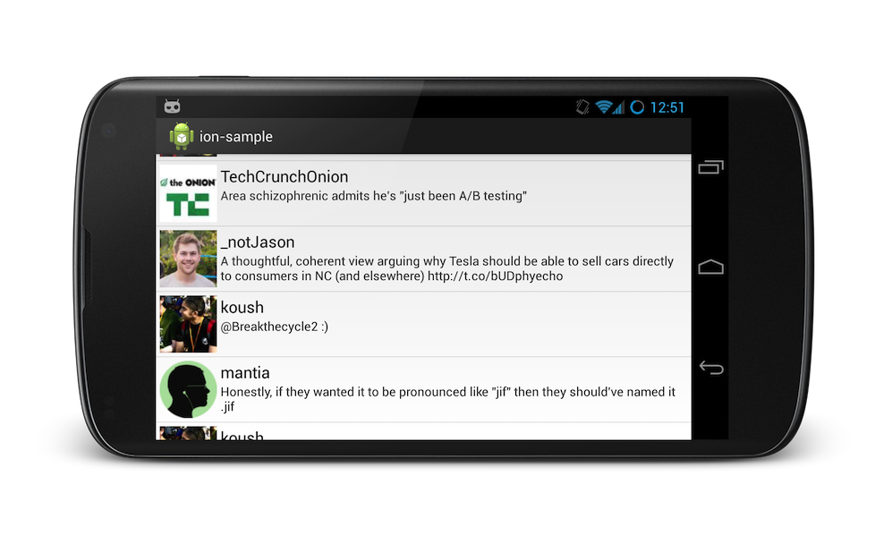

*Android Networking Made Easy*



#### Features
 * Asynchronously download:
   * Images (into ImageViews or Bitmaps)
   * JSON
   * Strings
   * Files
   * Java types using Gson
 * Easy to use Fluent API designed for Android
   * Automatically cancels operations when the calling Activity finishes
   * Manages invocation back onto the UI thread
   * ImageView loading, caching, and memory management (including ListView and convertView recycling)
   * All operations return a [Future](http://developer.android.com/reference/java/util/concurrent/Future.html) and can be cancelled
 * HTTP POST/PUT:
   * text/plain
   * application/json
   * application/x-www-form-urlencoded
   * multipart/form-data
 * Transparent usage of HTTP features and optimizations:
   * Caching
   * Gzip/Deflate Compression
   * Connection reuse
   * Cookies
 * Request level logging and profiling
 * Download progress callbacks
 * Supports file:/, http(s):/, and content:/ URIs
 * Based on [NIO](http://en.wikipedia.org/wiki/New_I/O) and [AndroidAsync](https://github.com/koush/AndroidAsync)

#### Samples

The included documented [ion-sample](https://github.com/koush/ion/tree/master/ion-sample) project includes some samples that demo common Android network operations:

 * [Twitter Client Sample](https://github.com/koush/ion/blob/master/ion-sample/src/com/koushikdutta/ion/sample/Twitter.java)
   * Download JSON from a server (twitter feed)
   * Populate a ListView Adapter and fetch more data as you scroll to the end
   * Put images from a URLs into ImageViews (twitter profile pictures)
 * File Download with [Progress Bar Sample](https://github.com/koush/ion/blob/master/ion-sample/src/com/koushikdutta/ion/sample/ProgressBarDownload.java)
 
#### More Examples

Looking for more? Check out the examples below that demonstrate some other common scenarios. You can also take a look
at 30+ ion unit tests in the [ion-test](https://github.com/koush/ion/tree/master/ion-test/src/com/koushikdutta/ion/test).

#### Get JSON

```java
Ion.with(context).load("http://example.com/thing.json")
.asJSONObject()
.setCallback(new FutureCallback<JSONObject>() {
   @Override
    public void onCompleted(Exception e, String result) {
        // do stuff with the result or error
    }
});
```

#### Post JSON and read JSON

```java
JSONObject json = new JSONObject();
json.putString("foo", "bar");

Ion.with(context).load("http://example.com/post")
.setJSONObjectBody(json)
.asJSONObject()
.setCallback(new FutureCallback<JSONObject>() {
   @Override
    public void onCompleted(Exception e, String result) {
        // do stuff with the result or error
    }
});
```

#### Download a File with a progress bar

```java
Ion.with(context).load("http://example.com/really-big-file.zip")
.progressBar(progressBar)
.write(new File("/sdcard/cm-11.zip")
.setCallback(new FutureCallback<File>() {
   @Override
    public void onCompleted(Exception e, File file) {
        // download done...
        // do stuff with the File or error
    }
});
```

#### Setting Headers

```java
Ion.with(context).load("http://example.com/test.txt")
// set the header
.setHeader("foo", "bar")
.asString()
.setCallback(...)
```

#### Load an image into an ImageView

```java
// This is the "long" way to do build an ImageView request... it allows you to set headers, etc.
Ion.with(context)
.load("http://example.com/image.png")
.withBitmap()
.placeholder(R.drawable.placeholder_image)
.error(R.drawable.error_image)
.animateLoad(spinAnimation)
.animateIn(fadeInAnimation)
.intoImageView(imageView);

// but for brevity, use the ImageView specific builder...
Ion.with(imageView)
.placeholder(R.drawable.placeholder_image)
.error(R.drawable.error_image)
.animateLoad(spinAnimation)
.animateIn(fadeInAnimation)
.load("http://example.com/image.png");
```

The Ion Image load API has the following features:
 * Disk and memory caching
 * Bitmaps are held via weak references so memory is managed very effeciently
 * ListView Adapter recycling support
 * Bitmap transformations via the .transform(Transform)
 * Animate loading and loaded ImageView states


#### Futures
_All_ operations return a custom [Future](http://developer.android.com/reference/java/util/concurrent/Future.html) that allows
you to specify a callback that runs on completion.

```java
public interface Future<T> extends Cancellable, java.util.concurrent.Future<T> {
    /**
     * Set a callback to be invoked when this Future completes.
     * @param callback
     * @return
     */
    public Future<T> setCallback(FutureCallback<T> callback);
}

Future<String> string = Ion.with(context)
    .load("http://example.com/string.txt")
    .asString();

Future<JSONObject> json = Ion.with(context)
    .load("http://example.com/json.json")
    .asJSONObject();

Future<File> file = Ion.with(context)
    .load("http://example.com/file.zip")
    .write(new File("/sdcard/file.zip"));

Future<Bitmap> bitmap = Ion.with(context)
    .load("http://example.com/image.png")
    .intoImageView(imageView);

```

#### Blocking on Requests

Though you should try to use callbacks for handling requests whenever possible, blocking on requests is possible too.
All Futures have a Future<T>.get() method that waits for the result of the request, by blocking if necessary.

```java
JSONObject json = Ion.with(context).load("http://example.com/thing.json").asJSONObject().get();
```


### Seamlessly use your own Java classes with Gson
```java
public static class Tweet {
    public String id;
    public String text;
    public String photo;
}

public void getTweets() throws Exception {
    Ion.with(context)
    .load("http://example.com/api/tweets")
    .as(new TypeToken<List<Tweet>>(){});
    .setCallback(new FutureCallback<List<Tweet>>() {
       @Override
        public void onCompleted(Exception e, List<Tweet> tweets) {
          // chirp chirp
        }
    });
}
```
